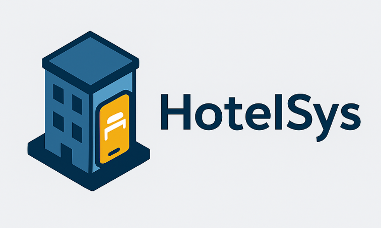

<p align="center">
  
</p>

# 🏨 Sistema de Gestión Hotelera – HotelSys

## 📖 Descripción

Este proyecto es un **Sistema de Gestión de Hotel** desarrollado con **Laravel 12**, **Livewire 3** y **FluxUI** como framework de componentes.  

Está diseñado para administrar:

- 👤 Clientes / Huéspedes  
- 🛏️ Habitaciones y Tipos de habitación  
- 📅 Reservaciones con estatus  
- 💳 Facturación y pagos  
- 🧾 Servicios extra (spa, comida, lavandería, etc.)  
- 👨‍💼 Empleados del hotel  

El sistema está optimizado para **un solo hotel** (no multihotel) y soporta **PostgreSQL**.

---

## 🚀 Tecnologías

- **Laravel 12** – Backend y ORM Eloquent  
- **Livewire 3** – Componentes dinámicos  
- **FluxUI** – UI moderna para Livewire  
- **PostgreSQL** – Base de datos relacional  

---

## ⚙️ Requisitos

- PHP 8.2+  
- Composer 2+  
- Node.js 18+ y NPM/Yarn  
- PostgreSQL 14+  
- Extensiones de PHP: `pgsql`, `pdo_pgsql`  

---

## 📦 Instalación

Clonar el repositorio:

```bash
git clone https://github.com/tuusuario/hotel-laravel.git
cd hotel-laravel
```

Instalar dependencias:

```bash
composer install
npm install && npm run build
```

Copiar el archivo de entorno:

```bash
cp .env.example .env
```

Configurar `.env`:

```dotenv
APP_NAME="Hotel Manager"
APP_URL=http://localhost:8000

DB_CONNECTION=pgsql
DB_HOST=127.0.0.1
DB_PORT=5432
DB_DATABASE=hotel_db
DB_USERNAME=postgres
DB_PASSWORD=secret
```

Generar key de Laravel:

```bash
php artisan key:generate
```

---

## 🗄️ Migraciones y Seeders

Ejecutar migraciones:

```bash
php artisan migrate
```

Ejecutar seeders (estatus de reservación y ejemplos):

```bash
php artisan db:seed
```

---

## 📌 Próximos pasos

- [ ] Implementar dashboard con Livewire + FluxUI  
- [ ] CRUD completo de clientes, habitaciones y reservaciones  
- [ ] Integrar calendario de reservas  
- [ ] Generación de reportes de ocupación y pagos  

---

## 📜 Licencia

Este proyecto se distribuye bajo licencia **MIT**.

